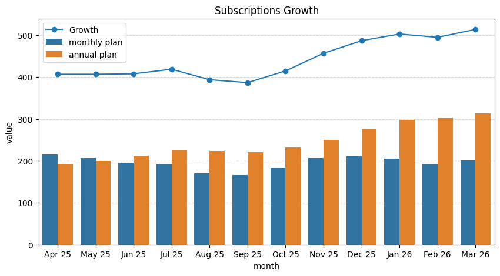
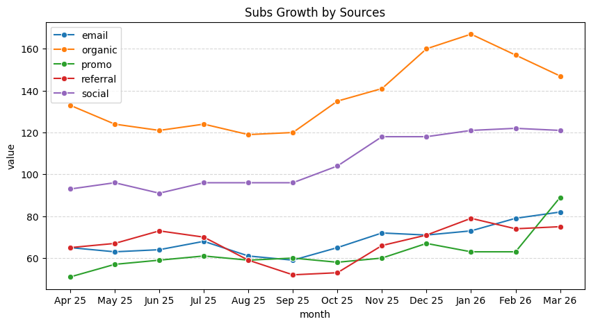
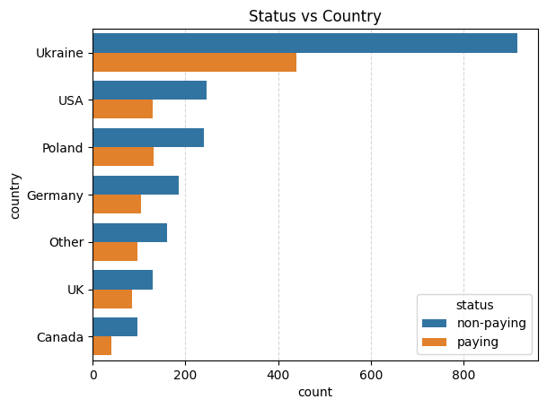
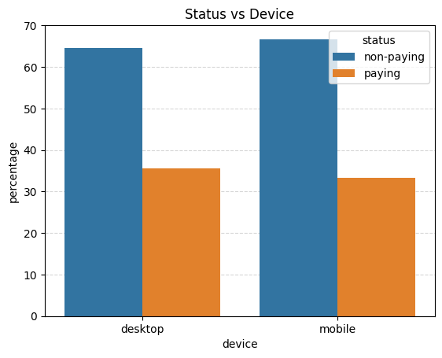
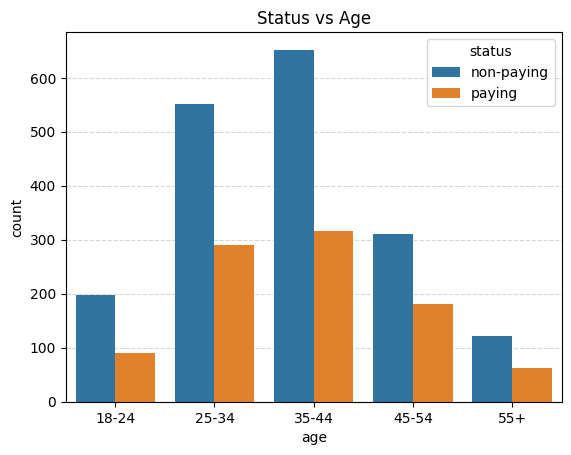
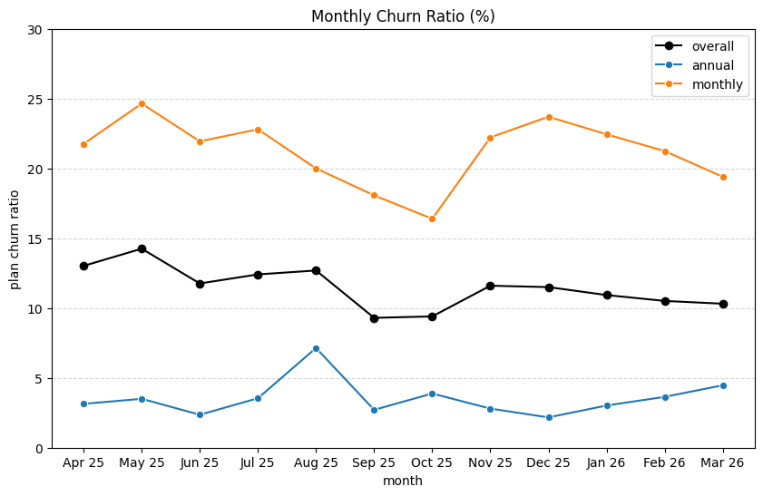
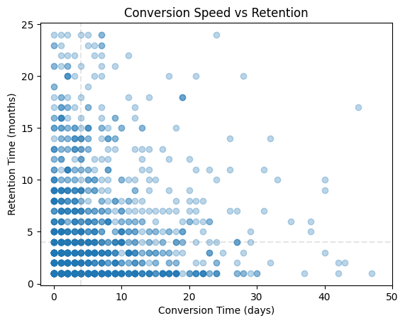
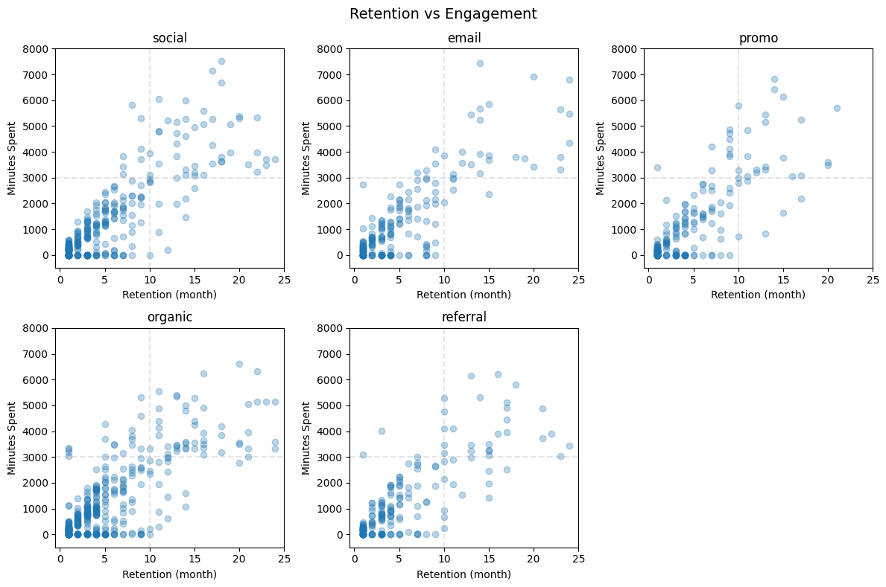
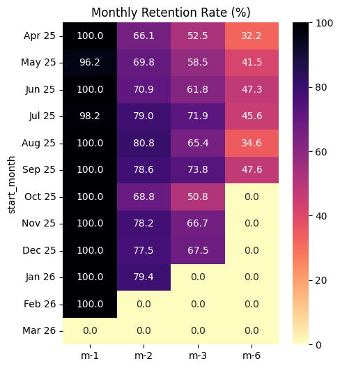
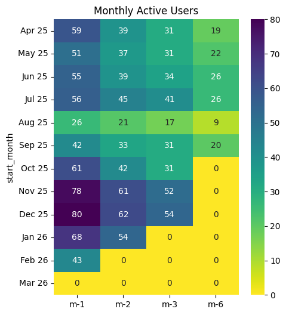

# Subscription Analysis Insights

This markdown acts as Jnomics Media - Data Analysis Test by Hanif Maulana Abdullah.
It will provide insights summary of my findings after analyzing tasks given in client-facing narrative.

---

## Executive Summary

- Subscribers increased 25% YoY.
- Promotions drove a surge in subscribers (peak in March 2026).
- Churn decreased in the last 4 months.
- Conversion time is inversely proportional to retention time.

---

## Key Insights

1. Subscriber growth is driven by promotions, not organic.
2. Annual plans are more popular than monthly plans.
3. Monthly plans tend to have higher churn than annual plans.
4. A decrease in churn indicates an improvement in user quality or experience.
5. Faster conversions → higher retention.
6. Social media produces the most loyal and engaged users.

---

## Supporting Evidence

---

## Recommendations

- Prioritize annual plan promotions to increase subscription growth.
- Replicate proven effective promotional strategies (March 2026) to drive growth.
- Optimize onboarding to accelerate user conversion.
- Increase investment in social media as a primary acquisition source for the most qualified users.
- Develop special promotional strategies for low-performance periods (e.g., summer).
